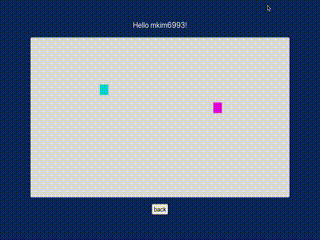

<div align="center">
<h3 align="center">WebSocket-Multiplayer</h3>

  <p align="center">
    Visualize real-time, bidirectional communication between React.js clients and an Express server!
    <br />
  </p>
</div>

<!-- ABOUT THE PROJECT -->
## About The Project

<div style="display: flex; justify-content: center;">
  
</div>

This application enables users to visualize real-time communication a frontend application and a backend server via Socket.io, a websocket library.

`Socket.IO is an event-driven library for real-time web applications. It enables real-time, bi-directional communication between web clients and servers.`

Here's how the app works...

1. <strong>Users enter a valid username and select a color for their square</strong> 
2. <strong>The User enters the environment at a random location</strong>
3. <strong>Users are free the move about the environment</strong>
4. <strong>Users can see the movements of other users in real-time</strong>

Upon entering the digital environment, a socket event is fired to the server where the state of all users and their locations are maintained.
If the environment is non-empty upon entering, the current state of all of the users and positions already in the game are sent to the joining user.
If a new user enters the environment, their intial position and state are recorded on the server and broadcasted to all users already in the environment.

In short, in order to reflect the most "truthful" state of the real-time environment, several websocket events/listeners are made when you join or when other people join.

Here is more on Socket.io if you're interested: https://socket.io/docs/v4

<p align="right">(<a href="#readme-top">back to top</a>)</p>


### Built With

* [![React][React.js]][React-url]
* [![Node][Node.js]][Node-url]
* [![Socket.io]][Socket.io-url]

<p align="right">(<a href="#readme-top">back to top</a>)</p>


<!-- GETTING STARTED -->
## Getting Started

After cloning, `cd` to the repository and run `npm install` in both the root and client directory. This is install all dependencies for this project. Ensure you have `npm` installed before this step.

Once all dependencies are installed, you will need to create two `.env` files: one in the root directory and one in the client directory.
This project was intended to be used with multiple devices. In try this app, you will need more than one PC and use your private IP address instead of localhost.
* /root
  ```sh
  PRIVATE_IP="XXX.XXX.X.XXX"
  CLIENT_PORT="3000" # ex.
  SERVER_PORT="3001" # ex.
  ```
* /client
  ```sh
  REACT_APP_PRIVATE_IP="XXX.XXX.X.XXX"
  REACT_APP_SERVER_PORT="3001"
  ```
  
Once all dependencies have been installed and all environment variables are initialized, you are ready to run the project.

Start the server by running `npm start` in the root directory.

Start the client-side application by running `npm start` in the client directory. 

Navigate to `http://XXX.XXX.X.XXX:CLIENT_PORT`.

Enter your username and select your color.
After enter the environment, move around using you "ASDW" keys on your keyboard.

To have another user join, enter `http://XXX.XXX.X.XXX:CLIENT_PORT` on the browser of another PC.

<p align="right">(<a href="#readme-top">back to top</a>)</p>

<!-- CONTACT -->
## Contact

Minsung - kmaxsung@gmail.com

<p align="right">(<a href="#readme-top">back to top</a>)</p>


<!-- MARKDOWN LINKS & IMAGES -->
[product-screenshot]: client/public/output.gif
[React.js]: https://img.shields.io/badge/React-20232A?style=for-the-badge&logo=react&logoColor=61DAFB
[React-url]: https://reactjs.org/
[Node.js]: https://img.shields.io/badge/Node.js-43853D?style=for-the-badge&logo=node.js&logoColor=white
[Node-url]: https://nodejs.org/en
[Socket.io]: https://img.shields.io/badge/Socket.io-black?style=for-the-badge&logo=socket.io&badgeColor=010101
[Socket.io-url]: https://socket.io/
[WebRTC]: https://img.shields.io/badge/WebRTC-333?logo=webrtc&logoColor=fff&style=for-the-badge
[WebRTC-url]: https://webrtc.org/
